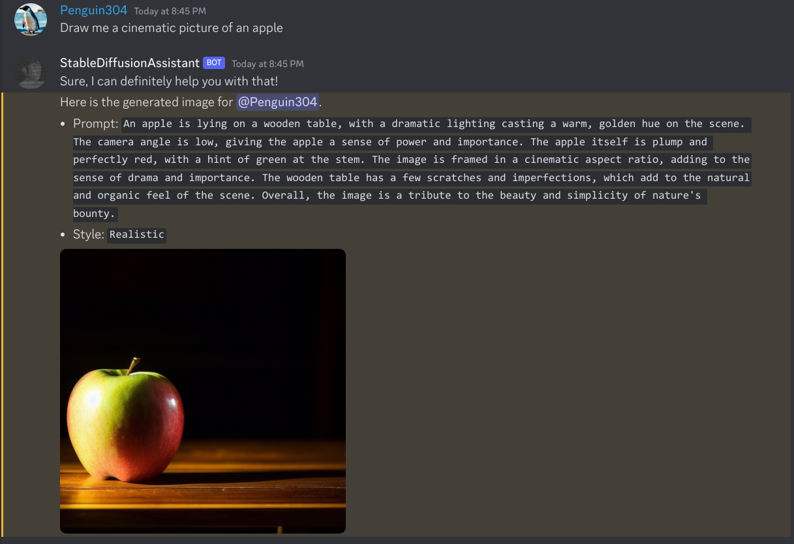

# AI Drawing ChatBot


This is an AI image generator Discord bot written in Python. It has a chatbot that uses ChatGPT!

This project uses various APIs, which allows it to run on less powerful computers.

**DISCLAIMER:** ChatGPT uses your Poe account.
I am not responsible if your Poe account gets banned, since using Poe in programs is against their TOS.



## Broken stuff
- Using Imaginepy

## Table of Contents
1. [Features](#Features)
2. [Notes](#Notes)
3. [Prerequisites](#Prerequisites)
4. [Windows Setup](#windows-setup)
5. [Linux/macOS Setup](#linux-and-macos-setup)
6. [Configuration](#Configuration)
7. [Generate images faster with Stable Horde](#Generate-images-faster-with-Stable-Horde)


## Features
- ChatGPT/GPT4All chatbot that is integrated with Stable Diffusion
- 3 slash commands for generating images
- Stable Diffusion
- Pollinations
- Anything Diffusion
- And more!


## Notes

- ChatGPT is the fastest model that you can use.
- While generating a response with GPT4All, the Discord bot will lock up.
No commands can be run until the bot finishes writing.
- Do not input any personal information on the `/imagine_poly` command because your generated image will be displayed
on their official frontpage.
- Please do not enter any personal information in the Chatbot or in the image generators,
because your prompts are sent to various providers.
- When you use Stable Horde to generate images, your prompts are sent to Stable Horde, as listed in their [privacy policy](https://stablehorde.net/privacy). 
- The chatbot may not work as expected if multiple users are chatting with it at once.
- When using Replit, GPT4All cannot be used.
- When using Replit, you must input your .env variables in the `Secrets` button in the sidebar.


## Prerequisites
This project assumes that:
- Python 3.8+ is installed and is on your PATH
- Pip is installed
- Python-venv is installed (only for certain Linux distros)
- Git is installed
- You know how to create a Discord Bot account
- You know JSON syntax (It's basically a Python Dictionary)


## Windows Setup
1. Create a Discord Bot and grab the token. Make sure to switch on Message Content Intent in the `Bot` tab of the [Developer Portal](https://discord.com/developers/applications).
2. Grab an API key from Stable Horde [at their register page](https://stablehorde.net/register).
3. Rename `example.env` to `.env` and place your bot token and your API key in under `API_KEY`.
4. [Register](https://poe.com) for Poe and open inspect tool. [Find your token](https://github.com/ading2210/poe-api#finding-your-token) and place it under `POE_TOKEN` in your `.env` file.
5. Place your Discord bot token under `BOT_TOKEN`.
6. Clone the Stable Horde module:
```shell
git clone https://github.com/mak448a/horde_module --depth=1
```
7. Create venv and install dependencies:
```shell
python -m venv venv
```
```shell
venv\Scripts\activate.bat
```
```shell
pip install -r requirements.txt
```
8. Invite the bot with the link it provides!
9. You can chat with the bot by mentioning it and typing your message. 
10. Edit `config.json` file however you like. See [Configuration](#Configuration).

## Linux and macOS Setup
1. Create a Discord Bot and grab the token. Make sure to switch on Message Content Intent in the `Bot` tab of the [Developer Portal](https://discord.com/developers/applications).
2. Grab an API key from Stable Horde [at their register page](https://stablehorde.net/register).
3. Rename `example.env` to `.env` and place your bot token and your API key in under `API_KEY`.
4. [Register](https://poe.com) for Poe and open inspect tool. [Find your token](https://github.com/ading2210/poe-api#finding-your-token).
5. Run the script!
```shell
sh run.sh
```
6. Invite the bot with the link it provides!
7. You can chat with the bot by mentioning it and typing your message.
8. Edit `config.json` file however you like. See [Configuration](#Configuration).

## Docker Setup
1. Make sure you have Docker installed on your machine.
2. Clone this repository to your local machine.
3. Build the Docker image using the following command:
```shell
docker build -t ai-drawing-chatbot .
```
4. Run the Docker container using the following command:
```shell
docker run -it --name chatbot ai-drawing-chatbot
```
5. Enter in your token values. Go [here](#linux-and-macos-setup) to find out how to get these.


## Configuration
<details><summary>Configuring chat model</summary>

Go to `config.json` and set the key `"model"` to the model you want.

**Available Models**
- ChatGPT
- GPT4All

You must write the model exactly as it is written here.
When using ChatGPT, you must sign up for a Poe account.

When you are done, the edited line should look like this:

```json
"model": "ChatGPT",
```

</details>

<details><summary>Disable chatbot</summary>

Go to `config.json` and set the key `"chatbot"` to false.

It should look like this:

```json
"chatbot": false,
```
</details>

<details><summary>Change loading GIF</summary>

Go to `config.json` and set the key `"loading_gif"` to any GIF on Tenor you want!

It should look like this:

```json
"loading_gif": "https://tenor.com/your/favorite/loading/gif",
```
</details>

<details><summary>Turn off command syncing (makes bot load faster)</summary>

Go to `config.json` and set the key `"sync"` to `false`.

It should look like this:

```json
"sync": false
```
</details>


## Generate images faster with Stable Horde
Stable Horde uses Kudos to rank users on a queue. The more Kudos you have, the higher you are on the generation queue.
You can get Kudos by rating images and/or generating images for Stable Horde
on your local hardware.
To get more Kudos, first stick your API key [here](https://tinybots.net/artbot/settings).
Then, rate some images generated by other users [here](https://tinybots.net/artbot/rate).
After rating a few images, you should have faster generation times!
**IMPORTANT: When an image says, "This rating must be x," you must rate it that.
This picture is used as a Captcha to avoid spam.**
